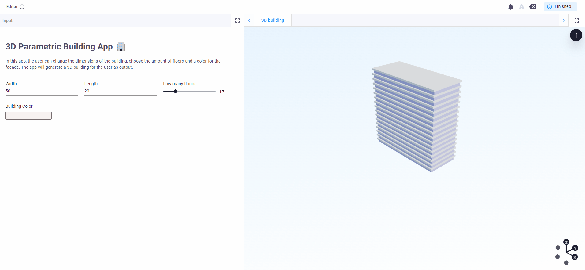

# Basic 3D model
This template app demonstrates how to create simple 3D elements and how to combine them into a parametric building, 
using Viktor and Python! As an engineer or architect, you may work with changing requirements for a project. In this 
template, an office building will be used as example. You can explore how to visualize 3D elements and create patterns
from Viktor inputs to create an interactive building. Like this you won't need to change any code when you need to 
change the requirements of the building.

This app contains:
- Changing the dimensions of the building: the width, length and the number of floors.
- Changing the color of the building.
- Viewing the results in a 3D view.

### Step 1: Change the dimensions
The width and length can be altered by filling in the number of the desired dimension in the input field. You can change
the number of floors by sliding the slider or changing the number in the input field.

### Step 2: Change the color
A new color for the building can be selected when clicking on the color block under "Building Color". Alternatively,
you can also input an RGB color code.

